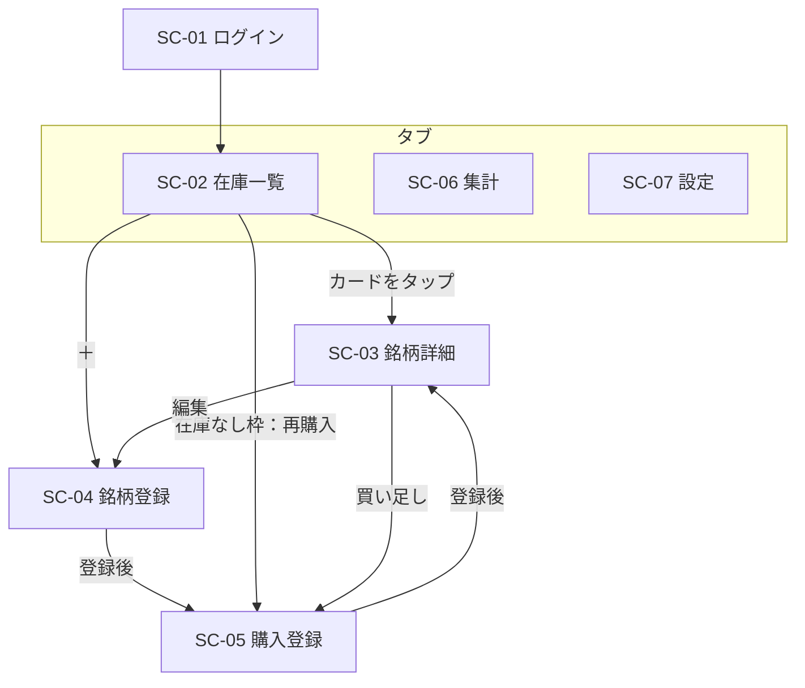

# Chaicoss（お茶在庫管理アプリ） 基本設計書

| 項目 | 内容 |
|---|---|
| 版 | 1.2 |
| 作成日 | 2026-09-26 |
| フェーズ | 基本設計 |
| 前提資料 | 01_requirements.md（v1.4）、02_tech_selection.md（v1.2） |
| 画面仕様 | 05_ui_design.md、ui/wireframe.html |

---

## 1. システム構成

```
スマートフォンのブラウザ
  └ React＋MUI（GitHub Pages）
      ├ Google Identity Services でログイン → IDトークン取得
      └ POST（Content-Type: text/plain）
            ↓
      GAS Webアプリ（実行ユーザー：自分／アクセス：全員）
            ├ IDトークン検証 ＋ 許可メールアドレス照合
            ├ LockService による排他制御
            └ Google スプレッドシート（GASをコンテナバインド）
```

| 構成要素 | 役割 |
|---|---|
| フロントエンド | 画面表示、入力チェック、楽観的UI（TanStack Query）、ルーティング（React Router／HashRouter） |
| GAS | 認証・認可、業務ロジック実行、整合性制御、スプレッドシート読み書き |
| スプレッドシート | データ永続化。直接の閲覧・バックアップにも利用 |
| shared | API型定義、ドメインロジック（引当、残り回数計算、バリデーション、強調判定） |

### 1.1 設定値の保管

| 設定値 | 保管場所 | 理由 |
|---|---|---|
| OAuthクライアントID | フロントエンドの環境変数（ビルド時埋め込み） | 公開されても問題ない |
| GAS WebアプリURL | フロントエンドの環境変数（ビルド時埋め込み） | 公開されても問題ない（保護はトークン検証で担保） |
| 許可メールアドレス一覧 | GASのスクリプトプロパティ | 公開リポジトリに置かないため |
| OAuthクライアントID（検証用） | GASのスクリプトプロパティ | IDトークンの aud 照合に使用 |

---

## 2. 認証・認可

1. フロントエンドは Google Identity Services で自動ログインを試みる。失敗時のみログイン画面（SC-01）を表示する
2. 取得したIDトークンを全APIリクエストに含める
3. GASはIDトークンを検証し、以下をすべて満たす場合のみ処理する
   - トークンが有効（署名・有効期限）
   - aud がOAuthクライアントIDと一致
   - メールアドレスが検証済み、かつ許可メールアドレス一覧に含まれる
4. トークン失効時はフロントエンドが再取得し、リクエストを再送する（op_idは同一のまま再送するため、冪等性により二重処理にならない）

---

## 3. 画面設計

### 3.1 画面一覧

| ID | 画面 | 主な内容 | 対応要件 |
|---|---|---|---|
| SC-01 | ログイン | Googleログインボタン（自動ログイン失敗時のみ） | NFR-02, 03 |
| SC-02 | 在庫一覧（ホーム） | 銘柄カード一覧（参照専用）、絞り込み・並び替え、在庫なし枠 | FR-21, 22, 24, 25 |
| SC-03 | 銘柄詳細 | 消費操作、ロット一覧と操作、マスタ情報、履歴、編集・削除、買い足し | FR-03, 04, 13〜18, 26 |
| SC-04 | 銘柄登録・編集 | 入力フォーム（新規時は続けて購入登録へ） | FR-02, 03 |
| SC-05 | 購入登録 | 購入量、賞味期限（任意）、購入日 | FR-11〜13 |
| SC-06 | ジャンル別集計 | ジャンルごとの銘柄数・合計残量（単位別） | FR-23 |
| SC-07 | 設定 | ジャンル管理、削除済み銘柄・使い切りロットの一覧と復元、ログアウト | FR-01, 04, 18 |

### 3.2 画面遷移



- 画面下部のタブで SC-02／SC-06／SC-07 を切り替える
- 使い切り確認、残量調整、量指定、競合エラーはダイアログで表示する

### 3.3 主要画面の構成

#### SC-02 在庫一覧
- 銘柄カード：銘柄名、ジャンル、フレーバー、合計残量、残り回数、最も近い賞味期限
- 強調表示（3.4参照）をカード上にバッジで表示する
- 消費操作は置かない（誤操作防止）
- 下部に「在庫なし」枠（有効ロットを持たない銘柄）と「再購入」ボタン

#### SC-03 銘柄詳細
- 上部：消費操作
  - 杯数選択（－／＋、初期値1）＋「飲んだ」（主ボタン）：引当ルール（5.1）で決まるロットから1回分の量×杯数を減算
  - 杯数の上限は引当対象ロットの残り回数とする
  - 「量を指定して飲んだ」：量を直接入力して減算（ブレンド時など）
  - 「残り全部使った」：引当対象ロットの残量が1回分未満の場合、主ボタンの代わりに強調表示
- ロット一覧：ロットごとに残量・賞味期限・購入日、ロット指定での消費、残量調整、使い切り、賞味期限等の修正
- マスタ情報、編集・削除ボタン、買い足しボタン
- 在庫履歴

### 3.4 強調表示ルール

| 種別 | 条件 | 表示 |
|---|---|---|
| 期限切れ | 賞味期限 ＜ 当日 | 最も強い強調 |
| 期限間近 | 当日 ≦ 賞味期限 ≦ 当日＋30日 | 強調 |
| 残りわずか | 残り回数 ≦ 3 | 強調 |

- 賞味期限が未入力のロットは期限による強調の対象外
- 銘柄カードでは、配下の有効ロットのうち最も強い状態を表示する
- 閾値は shared の定数として定義する

### 3.5 共通UI
- 使い切り直後に「元に戻す」付きの通知（スナックバー）を表示する
- 楽観的更新に失敗した場合は画面を元に戻し、エラー内容を通知する
- 競合（楽観ロック違反）時は最新データを再取得し、再操作を促す

---

## 4. データ設計

### 4.1 シート一覧

| シート | 内容 |
|---|---|
| genres | ジャンルマスタ |
| colors | 色マスタ（ジャンルの色の候補。スプレッドシートで直接編集する） |
| brands | 銘柄マスタ |
| lots | 在庫ロット |
| stock_histories | 在庫履歴 |
| operations | 操作ログ（冪等性チェック用） |

### 4.2 共通列（genres, brands, lots）

| 列 | 内容 |
|---|---|
| version | 版番号（楽観ロック用、更新ごとに＋1） |
| created_at / created_by | 作成日時 / 作成者メールアドレス |
| updated_at / updated_by | 更新日時 / 更新者メールアドレス |

### 4.3 genres

| 列 | 型 | 必須 | 内容 |
|---|---|---|---|
| genre_id | UUID | ○ | 主キー |
| name | 文字列 | ○ | ジャンル名（一意） |
| color | 文字列 | ○ | 色コード（例：`#9a3f1c`）。colors に存在する値 |
| sort_order | 整数 | ○ | 表示順 |

### 4.3.1 colors

共通列（version 等）は持たない。アプリからは参照のみで、追加・変更はスプレッドシートを直接編集する。

| 列 | 型 | 必須 | 内容 |
|---|---|---|---|
| color_code | 文字列 | ○ | 主キー。`#rrggbb` 形式 |
| name | 文字列 | ○ | 色名（読み上げ・一覧表示用） |
| sort_order | 整数 | ○ | 候補の表示順 |

- ジャンルは色コードを値として保持する（色マスタから行を削除しても、既存ジャンルの色は変わらない）
- 初期値は05_ui_design.mdの11色

### 4.4 brands

| 列 | 型 | 必須 | 内容 |
|---|---|---|---|
| brand_id | UUID | ○ | 主キー |
| name | 文字列 | ○ | 銘柄名 |
| genre_id | UUID | ○ | ジャンル |
| flavors | JSON配列文字列 | ○ | 例：`["桜","梨","林檎"]`。なしは `[]` |
| form | LEAF / BAG | ○ | 茶葉／ティーバッグ |
| serving_amount | 数値 | ○ | 1回分の量。既定値 LEAF＝3、BAG＝1 |
| shop | 文字列 | － | 購入店 |
| memo | 文字列 | － | メモ |
| is_deleted | 真偽 | ○ | 論理削除フラグ |
| deleted_at | 日時 | － | 論理削除日時 |

### 4.5 lots

| 列 | 型 | 必須 | 内容 |
|---|---|---|---|
| lot_id | UUID | ○ | 主キー |
| brand_id | UUID | ○ | 銘柄 |
| initial_qty | 数値 | ○ | 購入量 |
| remaining_qty | 数値 | ○ | 残量 |
| best_before | 日付 | － | 賞味期限 |
| purchased_on | 日付 | ○ | 購入日 |
| is_depleted | 真偽 | ○ | 使い切り（論理削除）フラグ |
| depleted_at | 日時 | － | 使い切り日時 |

### 4.6 stock_histories

| 列 | 型 | 必須 | 内容 |
|---|---|---|---|
| history_id | UUID | ○ | 主キー |
| occurred_at | 日時 | ○ | 発生日時 |
| user_email | 文字列 | ○ | 操作者 |
| lot_id | UUID | ○ | 対象ロット |
| brand_id | UUID | ○ | 対象銘柄（検索用の冗長列） |
| delta | 数値 | ○ | 増減量（購入は正、消費は負） |
| servings | 整数 | － | 杯数（杯数指定の消費時のみ。将来の消費統計用） |
| qty_after | 数値 | ○ | 操作後残量（検証用の冗長列） |
| reason | 区分 | ○ | IN / CONSUME / ADJUST / DEPLETE / RESTORE |
| op_id | UUID | ○ | 発生元の操作ID |

### 4.7 operations

| 列 | 型 | 必須 | 内容 |
|---|---|---|---|
| op_id | UUID | ○ | 主キー（フロントエンドで採番） |
| op_type | 文字列 | ○ | action名 |
| processed_at | 日時 | ○ | 処理日時 |
| user_email | 文字列 | ○ | 操作者 |
| result | JSON文字列 | ○ | 処理結果（重複受信時にそのまま返却） |

### 4.8 値のルール
- 残量・量：LEAFは小数第1位まで、BAGは整数
- 日時：ISO 8601（JST、`+09:00` 付き）
- 日付：`YYYY-MM-DD`
- 残り回数・合計残量・強調状態などの導出値は保存せず、フロントエンド（shared）で算出する

---

## 5. 業務ルール

### 5.1 引当（消費対象ロットの決定）
- ロット指定がない場合、対象銘柄の有効ロット（is_depleted＝false）から1ロットを選ぶ
- 並び順：賞味期限の昇順（未入力は最後）→ 購入日の昇順 → 作成日時の昇順
- 1回の消費は1ロットに限定する（ロットをまたいだ引当は行わない）

### 5.2 消費
- 指定方法は「杯数」または「量」のいずれか（両方指定は入力エラー、両方省略時は杯数1）
- 杯数指定時の量 ＝ serving_amount × 杯数。serving_amount はサーバー側で最新の銘柄マスタから取得する
- 量 ＞ 対象ロットの残量 の場合はエラー（残量不足）とし、フロントエンドは「残り全部使った」を促す
- 消費の結果、残量が0になった場合、フロントエンドは使い切り確認ダイアログを表示する

### 5.3 残り回数
- 残り回数 ＝ floor（有効ロットの残量合計 ÷ serving_amount）

### 5.4 削除・復元
- 銘柄の論理削除：有効ロットが残っている場合は不可（業務エラー）
- ジャンルの削除：参照している銘柄（削除済み含む）がある場合は不可
- 使い切りの取り消し：直前の残量（使い切り時の履歴から算出）に戻す

---

## 6. API設計

### 6.1 共通仕様
- エンドポイント：GAS WebアプリURL 1本、全リクエストPOST（`Content-Type: text/plain`、本文はJSON）
- リクエスト：`{ action, idToken, opId?, payload }`（opIdは更新系で必須）
- レスポンス（成功）：`{ ok: true, data }`
- レスポンス（失敗）：`{ ok: false, error: { code, message } }`

### 6.2 API一覧

| 区分 | action | 内容 | 冪等性 | 排他 | 楽観ロック |
|---|---|---|---|---|---|
| 参照 | getAll | ジャンル・銘柄・ロットを一括取得（削除済み含む） | － | － | － |
| 参照 | getHistories | 指定銘柄の在庫履歴取得 | － | － | － |
| ジャンル | createGenre | 登録 | ○ | ○ | － |
| ジャンル | updateGenre | 編集（名前・表示順） | ○ | ○ | ○ |
| ジャンル | deleteGenre | 削除（参照中は不可） | ○ | ○ | ○ |
| 銘柄 | createBrand | 登録 | ○ | ○ | － |
| 銘柄 | updateBrand | 編集 | ○ | ○ | ○ |
| 銘柄 | deleteBrand / restoreBrand | 論理削除・復元 | ○ | ○ | ○ |
| 在庫 | receiveLot | 購入登録（ロット作成、IN記録） | ○ | ○ | － |
| 在庫 | consume | 消費（ロット省略可、杯数または量を指定、差分更新、CONSUME記録） | ○ | ○ | － |
| 在庫 | adjustLot | 残量の直接修正（差分を算出しADJUST記録） | ○ | ○ | ○ |
| 在庫 | updateLot | 賞味期限・購入日の修正 | ○ | ○ | ○ |
| 在庫 | depleteLot | 使い切り（残量を0にしDEPLETE記録） | ○ | ○ | ○ |
| 在庫 | restoreLot | 使い切り取り消し（RESTORE記録） | ○ | ○ | ○ |

### 6.3 更新系の処理フロー

```
1. 認証・認可
2. 入力検証
3. LockService.getScriptLock() 取得（待機上限あり）
4. operations に op_id が存在 → 保存済み result を返却して終了
5. 楽観ロック対象なら version を照合（不一致 → 競合エラー）
6. 業務処理（シート更新、version＋1）
7. 在庫変動があれば stock_histories に記録
8. operations に op_id と result を記録
9. ロック解放、result を返却
```

### 6.4 エラー区分（概要）

| 区分 | 例 |
|---|---|
| 認証エラー | トークン無効・期限切れ |
| 認可エラー | 許可されていないメールアドレス |
| 入力エラー | 必須項目なし、形式不正 |
| 対象なし | 指定IDが存在しない |
| 競合 | 版番号不一致 |
| 業務エラー | 残量不足、参照中のジャンル削除、有効ロットが残る銘柄の削除 |
| ロック取得失敗 | 待機上限超過 |
| システムエラー | 想定外の例外 |

具体的なエラーコードは詳細設計で定義する。

---

## 7. 詳細設計への持ち越し事項

| No | 内容 |
|---|---|
| 1 | 各APIのリクエスト・レスポンス型、エラーコード |
| 2 | 画面ごとの項目定義・入力チェック・コンポーネント構成 |
| 3 | GASのモジュール構成・バンドラー選択（Vite／Rollup） |
| 4 | シートの読み書き方式（一括読み込み、行の特定方法） |
| 5 | 在庫履歴・操作ログの肥大化への対応（保持期間等） |
| 6 | ディレクトリ構成の詳細 |
